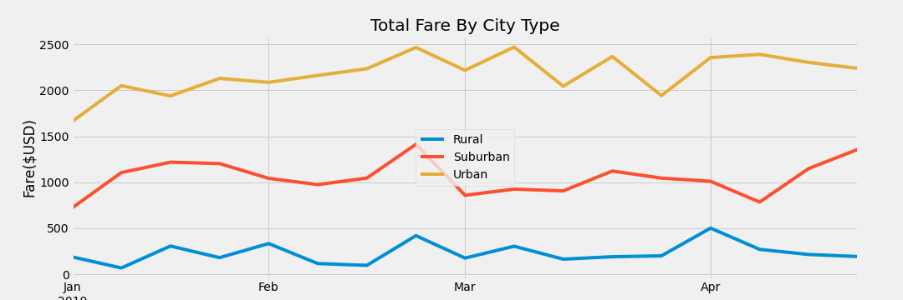

# PyBer_Analysis
## Overview of Project
A visualization and interpretation of total weekly fares for ride-sharing by city type.

### Purpose
Applying Python and Pandas, a summary DataFrame of the ride-sharing data by city type was created. Then, using Pandas and Matplotlib, a multiple-line graph that shows the total weekly fares for each city type was created.  These visualizations summarize how the data differs by city type and how those differences can be used by decision-makers at PyBer.

---

## Results and Analysis

Please refer to the following table:

|Type|Total Rides|Total Drivers|Total Fares|Average Fare per Ride|Average Fare per Driver|
|---|---|---|---|---|---|
|Rural|125|78|$4,327.93|$34.62|$55.49|
|Suburban|625|490|$19,356.33|$30.97|$39.50|
|Urban|1625|2405|$39,854.38|$24.53|$16.57|

As one would expect, as the population density declines, the amount of rides decreases.  Personal vehicle ownership increases as one moves from higher population densities to lower population densities.

Another interesting item to note: The Average Fare per Ride and Average Fare per Driver have an inverse relationship to city type.  As the population density increases, the average fares decrease.

Please refer to the following chart:

Generally speaking, Urban usage of ride-sharing dwarfs that of Rural and Suburban ride-sharing.
---

## Results

We recommend the following to address disparities among city types:
- Advertise to prospective rural community drivers that their fares are significantly higher than those of their peers in 'The Big City', so there's money to be made!
- Incentivize Urban (and Suburban) drivers to service Rural areas, due to the generally more-lucrative fares.  This will, in turn, make customers in Rural areas more inclined to use the service.
- Incentivize prospective customers using the app to share their ride with other customers.  While this may increase the amount of time for some people, it will drive down the cost to the customer, while simultaneously increasing the Average Fare per Driver, by virtue of having multiple customers serviced at once.
